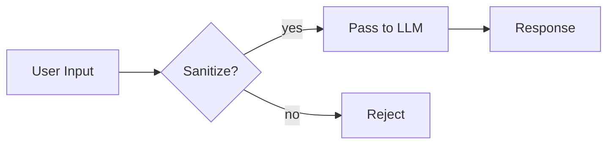

<!--
╔══════════════════════════════════════════════════════════════════╗
║  MARKDOWN CHEATSHEET  ::  everything you forget at 2 a.m.        ║
║  maintainer: you                                                 ║
║  last known good: whenever you last pushed                       ║
╚══════════════════════════════════════════════════════════════════╝
-->

<p align="center">
  
</p>

<h1 align="center">📓 Markdown Cheatsheet</h1>

<p align="center">
  <em>A field manual for rendering pretty text on the internet.</em><br>
  <sub>GitHub-flavored. Battle-tested. Cat-approved.</sub>
</p>

---

## 🗺️ Table of Contents

- [The 30-Second Version](#the-30-second-version)
- [Headers](#headers)
- [Text Formatting](#text-formatting)
- [Lists](#lists)
- [Links](#links)
- [Images](#images)
- [Code](#code)
- [Tables](#tables)
- [Blockquotes](#blockquotes)
- [GitHub Alerts](#github-alerts)
- [Horizontal Rules](#horizontal-rules)
- [Line Breaks & Escaping](#line-breaks--escaping)
- [GitHub Superpowers](#github-superpowers)
  - [Task Lists](#task-lists)
  - [Collapsible Sections](#collapsible-sections)
  - [Mentions & References](#mentions--references)
  - [Emoji Shortcodes](#emoji-shortcodes)
  - [Footnotes](#footnotes)
  - [Mermaid Diagrams](#mermaid-diagrams)
  - [LaTeX Math](#latex-math)
  - [Syntax Highlighting Languages](#syntax-highlighting-languages)
- [Badges](#badges)
- [Anchors & Internal Links](#anchors--internal-links)
- [HTML Inside Markdown](#html-inside-markdown)
- [README Patterns That Work](#readme-patterns-that-work)
- [Gotchas & Hard-Won Knowledge](#gotchas--hard-won-knowledge)

---

## The 30-Second Version

```markdown
# H1        **bold**          [link](url)          
## H2       *italic*          `inline code`        > quote
### H3      ~~strike~~        ```lang block```     - list
- [ ] task  | col | col |                          1. ordered
```

That covers 90% of daily use. The rest of this doc is for the other 10% that will save you when you're writing a serious README.

---

## Headers

```markdown
# H1 — page title (one per doc)
## H2 — major section
### H3 — subsection
#### H4
##### H5
###### H6 (rarely useful)
```

> **Rule of thumb:** only one `H1` per file. GitHub uses the filename/repo name as the "real" title anyway, so some people skip `H1` entirely in READMEs and start at `H2`. Both are fine. Pick one and be consistent.

**Alternative H1/H2 syntax** (rarely seen, but valid):
```markdown
Big Title
=========

Subtitle
--------
```

---

## Text Formatting

| Effect              | Syntax                     | Result                     |
| ------------------- | -------------------------- | -------------------------- |
| Bold                | `**bold**` or `__bold__`   | **bold**                   |
| Italic              | `*italic*` or `_italic_`   | *italic*                   |
| Bold + italic       | `***both***`               | ***both***                 |
| Strikethrough       | `~~gone~~`                 | ~~gone~~                   |
| Inline code         | `` `code` ``               | `code`                     |
| Highlight (GH only) | `==text==` ❌ *not on GH*   | —                          |
| Superscript         | `<sup>2</sup>`             | x<sup>2</sup>              |
| Subscript           | `<sub>n</sub>`             | H<sub>2</sub>O             |
| Underline           | `<u>text</u>`              | <u>text</u>                |
| Keyboard key        | `<kbd>Ctrl</kbd>`          | <kbd>Ctrl</kbd>            |

> GitHub does **not** support `==highlight==` the way Obsidian does. If you need emphasis on a phrase, use bold or a `> blockquote`.

---

## Lists

### Unordered

```markdown
- first
- second
  - nested (indent 2 spaces)
  - also nested
    - deeper still
- third
```

You can use `-`, `*`, or `+`. Pick one and stick with it. `-` is the most common convention.

### Ordered

```markdown
1. first
2. second
3. third
```

Pro tip: the numbers don't have to be right. This renders identically:

```markdown
1. first
1. second
1. third
```

Useful when you're inserting items mid-list and don't want to renumber everything.

### Mixed / nested

```markdown
1. Boot the lab
   - spin up the VM
   - confirm network
2. Run the payload
   1. stage one
   2. stage two
3. Collect the loot
```

### Task lists

See [Task Lists](#task-lists) below — they render as actual checkboxes on GitHub.

---

## Links

```markdown
[inline link](https://example.com)
[link with title](https://example.com "hover text")
[reference-style link][1]
<https://autolink.com>
<email@example.com>

[1]: https://example.com
```

**Reference-style** is tidier when the same URL appears multiple times or the URL is long:

```markdown
See the [docs][d] and the [source][s]. Also check [the docs][d] again.

[d]: https://example.com/docs
[s]: https://github.com/user/repo
```

**Relative links** (inside the same repo) — use these instead of absolute URLs when linking to files in the same repo. They survive forks and renames better:

```markdown
[see the setup guide](./docs/setup.md)
[jump to the contributing file](../CONTRIBUTING.md)
```

---

## Images

### Standard syntax (no alignment)

```markdown


```

### Centered image (the HTML trick)

Standard markdown can't center images. Use inline HTML — GitHub allows it:

```html
<p align="center">
  
</p>
```

### Side-by-side images

```html
<p align="center">
  
  
</p>
```

### Image as a link

```markdown
[](https://where-it-links.com)
```

### Pulling from the repo vs. external

For images living in your repo, put them in an `assets/`, `docs/images/`, or `.github/` folder and reference them with a relative path. External images (imgur, etc.) can disappear — local images live as long as the repo does.

---

## Code

### Inline

```markdown
Use `git rebase -i` to clean up history.
```

Use `git rebase -i` to clean up history.

### Fenced code blocks

````markdown
```python
def payload(target: str) -> None:
    print(f"sending to {target}")
```
````

Renders with syntax highlighting:

```python
def payload(target: str) -> None:
    print(f"sending to {target}")
```

### Code block with a filename hint

Some people prefix with a comment for clarity:

````markdown
```python
# agents/hornet.py
class Hornet:
    ...
```
````

### Indented code blocks (old-school)

Four leading spaces also produces a code block, but no syntax highlighting. Fenced blocks are better. Don't use indented blocks unless you're in a weird nested-list situation.

### Literal backticks

To show backticks inside inline code, use more backticks on the outside:

```markdown
Use `` `command --flag` `` in your shell.
```

Renders as: Use `` `command --flag` `` in your shell.

To show a fenced block **inside** a fenced block (like this cheatsheet does), use four backticks on the outside, three on the inside.

---

## Tables

```markdown
| Column A | Column B | Column C |
| -------- | :------: | -------: |
| left     | center   | right    |
| default  | middle   | right    |
```

Alignment is set by the colons in the separator row:
- `:---` → left
- `:---:` → center
- `---:` → right
- `---` → default (left)

**You don't need pretty spacing.** This works:

```markdown
|a|b|c|
|-|-|-|
|1|2|3|
```

But aligned columns are easier to edit later.

**Tables can contain:** inline code, links, bold/italic, line breaks via `<br>`, and even small images.
**Tables can't contain:** fenced code blocks, headers, or block-level elements. For those, fall back to an HTML `<table>`.

---

## Blockquotes

```markdown
> single-line quote

> multi-line quote
> that wraps across
> several lines

> nested
> > quote inside quote
> > > and deeper

> **Quotes can contain formatting.**
> - including lists
> - and `code`
```

---

## GitHub Alerts

GitHub renders these with colored icons and backgrounds. Huge quality-of-life for READMEs.

```markdown
> [!NOTE]
> Useful information that a user should know.

> [!TIP]
> Helpful advice for doing things better.

> [!IMPORTANT]
> Key information users need to succeed.

> [!WARNING]
> Urgent info that needs immediate attention.

> [!CAUTION]
> Advises about negative consequences.
```

> [!NOTE]
> These only render on GitHub (and some other renderers). In a plain markdown viewer they just look like blockquotes — which is fine.

---

## Horizontal Rules

Three or more of any of these on their own line:

```markdown
---
***
___
```

Use `---`. The others are just showing off.

---

## Line Breaks & Escaping

### Line breaks

A single line break in markdown is **ignored**. You need either:

1. Two spaces at the end of the line, then newline (invisible, easy to miss)
2. A blank line between paragraphs (cleanest)
3. An explicit `<br>` (works everywhere)

```markdown
line one  
line two   ← two trailing spaces above

paragraph one

paragraph two ← blank line separator

line one<br>
line two ← explicit break
```

### Escaping

Put a backslash before any character markdown would otherwise interpret:

```markdown
\*not italic\*
\`not code\`
\# not a header
\[not a link\]
\\ backslash itself
```

---

## GitHub Superpowers

Features that are GitHub-specific (or GitHub-flavored) and worth knowing.

### Task Lists

```markdown
- [x] boot the lab
- [x] run recon
- [ ] deliver payload
- [ ] collect loot
```

Renders as actual checkboxes. In issues and PRs you can **click them** to toggle without editing the source. Indispensable for TODOs.

### Collapsible Sections

```markdown
<details>
<summary>Click to expand</summary>

Hidden content goes here. Can include **formatting**, `code`, lists, images, whatever.

```python
print("even fenced code blocks work")
```

</details>
```

**Crucial rule:** leave a blank line after `<summary>` and before `</details>`, otherwise the content inside won't get rendered as markdown. Miss this and you'll see raw `**asterisks**` instead of **bold**.

Useful for long logs, optional details, FAQ-style READMEs.

### Mentions & References

In issues, PRs, commits, and discussions:

```markdown
@username           # notifies a user
@organization/team  # notifies a team
#123                # links to issue or PR #123
owner/repo#123      # cross-repo issue link
a1b2c3d             # links to a commit SHA
```

In README files these don't auto-link to users the same way, but still render as text.

### Emoji Shortcodes

```markdown
:rocket: :cat: :zap: :warning: :fire: :sparkles:
```

Renders as: 🚀 🐱 ⚡ ⚠️ 🔥 ✨

Full list: [gist.github.com/rxaviers/7360908](https://gist.github.com/rxaviers/7360908). You can also just paste Unicode emoji directly — both work.

### Footnotes

```markdown
Here's a claim that needs a source[^1] and another[^named].

[^1]: First footnote.
[^named]: Named footnotes work too and are easier to manage.
```

Footnotes get collected at the bottom of the rendered doc with back-links.

### Mermaid Diagrams

GitHub renders Mermaid natively. Flowcharts, sequence diagrams, state machines — all free:

````markdown

````

Other supported types: `sequenceDiagram`, `stateDiagram-v2`, `classDiagram`, `erDiagram`, `gantt`, `pie`, `gitGraph`, `journey`. Docs: [mermaid.js.org](https://mermaid.js.org/).

### LaTeX Math

Inline: `$E = mc^2$` renders as $E = mc^2$.

Block:

```markdown
$$
\sum_{i=1}^{n} x_i = \frac{1}{n} \cdot \text{something}
$$
```

Great for anything with actual math in the README — research repos, ML projects, papers.

### Syntax Highlighting Languages

The language tag after the opening ``` fence. Common ones:

```
python, py          javascript, js      typescript, ts
bash, sh, shell     powershell, ps1     zsh
yaml, yml           json                toml
html                css                 scss
markdown, md        dockerfile          makefile
c, cpp, rust, go    java, kotlin        ruby, rb
sql                 graphql             regex
diff                http                nginx
ini                 csv                 text (no highlighting)
```

For a full list: [github.com/github-linguist/linguist/blob/main/lib/linguist/languages.yml](https://github.com/github-linguist/linguist/blob/main/lib/linguist/languages.yml).

> [!TIP]
> Use `text` or `plaintext` when you explicitly want no highlighting. Use `diff` to show code changes with red/green coloring.

---

## Badges

Badges make a README look professional instantly. The standard source is [shields.io](https://shields.io/).

```markdown


```

Centered row of badges is a common README opener:

```html
<p align="center">
  
  
  
</p>
```

---

## Anchors & Internal Links

Every header automatically becomes a linkable anchor. The anchor is the header text, lowercased, with spaces replaced by `-` and most punctuation stripped.

```markdown
## My Section Name  →  anchor becomes #my-section-name

See [My Section Name](#my-section-name).
```

Rules GitHub applies when generating anchors:
- Lowercase everything
- Replace spaces with `-`
- Strip most punctuation (`.`, `!`, `?`, `:`, `(`, `)`, etc.)
- Keep hyphens, underscores, and alphanumerics
- Emoji and special chars get removed but leave hyphens behind

When in doubt, preview your doc and hover over the header — GitHub shows the anchor's exact name.

**Custom anchors** via HTML:

```markdown
<a id="my-custom-anchor"></a>
## My Section

Link to it: [jump](#my-custom-anchor)
```

---

## HTML Inside Markdown

GitHub allows a subset of HTML inside markdown. Useful for things markdown can't do:

| Need                    | HTML                            |
| ----------------------- | ------------------------------- |
| Center anything         | `<p align="center">…</p>`       |
| Image with width/height | ``   |
| Keyboard key            | `<kbd>Enter</kbd>`              |
| Line break              | `<br>`                          |
| Horizontal rule         | `<hr>`                          |
| Colored text            | Not supported on GitHub 😢       |
| Details/summary         | `<details><summary>…</summary>` |
| Small text              | `<sub>small</sub>`              |
| Underline               | `<u>under</u>`                  |

**What doesn't work:** `<style>` tags, `<script>` tags, most attributes beyond the safe-list. GitHub sanitizes HTML aggressively.

---

## README Patterns That Work

A few patterns worth stealing.

### The hero block

```markdown
<p align="center">
  
</p>

<h1 align="center">Project Name</h1>

<p align="center">
  <em>One-sentence description that makes the project sound cool.</em>
</p>

<p align="center">
  
  
</p>
```

### The tidy feature list

```markdown
## Features

- 🔒 **Safety-first** — designed to fail closed.
- ⚡ **Fast** — sub-millisecond latency on warm caches.
- 🧩 **Modular** — swap any component without touching the rest.
- 📚 **Documented** — every public API has a docstring.
```

### The FAQ block

```markdown
## FAQ

<details>
<summary><strong>Does this work on Windows?</strong></summary>

Yes, under WSL2. Native Windows is untested.
</details>

<details>
<summary><strong>Why not just use X?</strong></summary>

X doesn't support Y, which is the whole point of this project.
</details>
```

### The install block

````markdown
## Install

```bash
git clone https://github.com/user/repo.git
cd repo
pip install -e .
```
````

### The citation block (for research repos)

````markdown
## Citation

If you use this work, please cite:

```bibtex
@misc{yourname2026,
  title  = {Project Title},
  author = {Your Name},
  year   = {2026},
  url    = {https://github.com/user/repo}
}
```
````

---

## Gotchas & Hard-Won Knowledge

Things that will bite you eventually.

1. **Collapsible sections need a blank line after `<summary>`.** Miss it and the inner markdown won't render.

2. **Relative image paths break on `raw.githubusercontent.com`.** If you're using the repo README in another context (npm, PyPI), use absolute URLs for images.

3. **Tables can't contain fenced code blocks.** Fall back to `<table>` HTML if you really need this. Usually you can restructure to put the code outside the table instead.

4. **Line breaks are weird.** Two trailing spaces for a soft break is a classic footgun — they're invisible. Use `<br>` or a blank line for a paragraph break.

5. **GitHub strips most HTML attributes.** `style="..."` won't work. `class="..."` won't work. Inline `width` and `align` on images and `align` on `<p>` generally do.

6. **`#123` in READMEs doesn't auto-link to issues.** It only auto-links inside issues, PRs, commits, and discussions. In a README, write out the URL.

7. **Emoji in headers affects the anchor.** `## 🚀 Launch` becomes `#-launch` (the emoji is stripped but leaves a hyphen). Use the browser dev tools or hover the header to get the exact anchor.

8. **Don't put raw URLs inside `[text](url)` parentheses if the URL contains parens.** Percent-encode them: `%28` and `%29`. Or use reference-style links.

9. **Mermaid and LaTeX don't render everywhere.** They work on github.com and a few other places. If you want the repo README to look good on npm, PyPI, or a static site generator, don't rely on them for critical info.

10. **`README.md` is case-sensitive on some filesystems but not GitHub's display logic.** Name it exactly `README.md` (uppercase `README`, lowercase `.md`) and you'll never have a surprise.

---

<p align="center">
  <sub>🐈‍⬛ stay curious. break things responsibly. commit often. 🐈‍⬛</sub>
</p>
